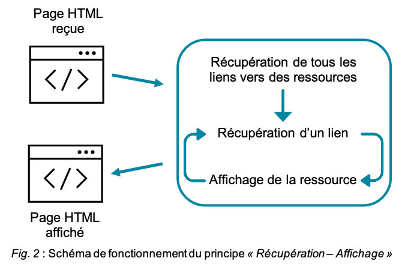

# Keep Control of Your Data

This repository contains a draft proposal of a system to give the control of the personal data back to their real owners. The work has been done by two engineering students of [IMT Atlantique](https://www.imt-atlantique.fr/en).

This repo is no longer maintained, and has been moved to [an other repository](https://gitlab.inria.fr/alebre/teaching-keepyourdata).

- [1. Proposal](#1-proposal)
  - [1.1. Working principles](#11-working-principles)
    - [1.1.1. *Catch-Store-Send* Principle](#111-catch-store-send-principle)
    - [1.1.2. *Get-Show* Principle](#112-get-show-principle)
- [2. Idée proposée](#2-idée-proposée)
  - [2.1. Principes de fonctionnement](#21-principes-de-fonctionnement)
- [3. Ce qui a été fait](#3-ce-qui-a-été-fait)
- [4. Ce qu'il reste à faire](#4-ce-quil-reste-à-faire)
  - [4.1. Extension](#41-extension)
    - [4.1.1. Critiques](#411-critiques)
    - [4.1.2. Importantes](#412-importantes)
    - [4.1.3. Secondaires](#413-secondaires)
  - [4.2. Services web de démo](#42-services-web-de-démo)

## 1. Proposal

In this project, we wanted to develop a solution that would allow internet users to really take back the control of their personal data. This solution is organized in two main parts:

1. The separation of the actors hosting the personal data from those using it. This way the services requesting the data to the user and using them would simply no longer have them, and would instead have fake data with a link pointing to the real data.
2. The implementation of an intermediate actor that would be there as a relay between the service hosting the data and the one using them. This intermediate actor would also be responsible of making sure the real data stays visible to the users that would only see them.

### 1.1. Working principles

Because the data would not longer be stored by the service using them, we had to design new ways to be able to send them, as well as see them, and the most seamless way possible for the end user. To that extent we have designed two principles that are to be implemented in the intermediate actor:

1. The [*Catch-Store-Send* principle](#111-catch-store-send-principle)
2. The [*Get-Show* principle](#112-get-show-principle)

Because this solution should be able to work on every services, whether or not their are designed to work with our solution, we had to find a way to include the link pointing to the user's data in the data that are sent to the service. We also had to find a way to respect the type of ressources requested, even for the fake data. So if the service asked for a picture, we have to send him a picture.

For the text-based data, there was no real problem because the links are also text. It would probably be necessary though to include it in some kind of template, to avoid possible issues in the sending as well as simplify the fetch in the source of the page.

For image-based ressources we decided to include the link inside a QR Code that is sent to the service. This way in the *Get-Show* principle, when getting the real data from the link, the intermediate actor simply has to decode the QR Code to get the link to the real image.

#### 1.1.1. *Catch-Store-Send* Principle

This principle is responsible for the storage of the personal data in a secure place as well as the sending of fake placeholder data to the final service. It works the following way:

1. When a user submits a form with data inside it, the intermediate actor intercepts and blocks the sending,
2. It then loops over each personal data the user has filled, and for each:
   1. Sends it to the user's remote storage
   2. Receives a link pointing to the original data from the remote storage
   3. Replaces the original data with the link
3. Send the form updated with the links to the service

#### 1.1.2. *Get-Show* Principle

This principle is responsible for display of the personal data to the final user, in place of the placeholder links to the data. It works the following way:

1. When the user visits a web page, the intermediate actor will scan the page to detect all links pointing to a distant user data
2. For each link found, it will:
   1. Get the data behind the link
   2. Transform the data to get the final version if needed (especially if the link points to an image)
3. Show the final data to the end user

***

(NOTE: The rest of this README is the same as what was said above, but in French, as well as a list of tasks (in French as well) that are, in our opinion, needed to be completed in order to have a working proof of concept.)

## 2. Idée proposée

Au sein de ce projet nous avons souhaité mettre en place une solution permettant aux utilisateurs de reprendre réellement le contrôle de leur données. Cette solution s'articule en deux points clés :

1. La séparation des acteurs hébergeant les données personnelles de ceux les utilisant. Ainsi les services demandant et utilisant des données ne les auraient tout simplement plus, et auraient à la place des fausses données contenant les liens pointant vers les vraies données.
2. La mise en place d’un acteur intermédiaire permettant de faire le lien entre le service hébergeur de données et celui qui les utilise. C'est cet acteur qui permettrait que les données personnelles soient toujours visibles pour les utilisateurs des service qui ne feraient que les consulter.

La solution que nous avons développé devait respecter deux contraintes assez fortes :

1. Elle devait pouvoir fonctionner sur n'importe quel service utilisant des données personnelles, quelque soit leur forme ou leur volume, et peut importe que ce service soit conçu pour ou non.
2. Son utilisation devait être la plus transparente possible pour l’utilisateur final.

### 2.1. Principes de fonctionnement

Les données n'étant plus stockées sur le service les utilisant, il a fallu concevoir de nouvelles manières pour permettre de stocker et afficher les données personnelles, et ce de manière la plus transparente possible. Pour ce faire nous avons conçu deux principes :

1. Le principe *Interception-Stockage-Envoi* (*ISE*) (voir *fig. 1*)
2. Le principe *Récupération-Affichage* (*RA*) (voir *fig. 2*)

Puisque notre solution devait pouvoir fonctionner sur tous les services, il nous fallait trouver un moyen d'intégrer les liens vers les données personnelles dans les données que nous renvoyons. Il fallait aussi respecter le type de ressources demandée, même pour des fausses données : si le service demande une image, il faut lui envoyer une image.

Pour des textes, le problèmes est vite résolu, puisqu'il suffit d'envoyer le lien reçu (il est toutefois probablement nécessaire de l'inclure dans une sorte de template, afin d'éviter des problèmes qui pourrait subvenir lors de l'envoi, et afin de le localiser plus facilement dans la page).

Pour des images, nous avons décidé d'inclure les liens dans des QR codes que nous envoyons ensuite au service. Ainsi lors de la récupération des données, le service envoye le QR code, nous le décodons pour avoir le lien contenu dedans et pouvons ensuite récupérer et afficher l'image.




***

## 3. Ce qui a été fait

La réalisation de ce projet repose sur deux parties :

- Le développement d’une [extension pour navigateur](extension/README.md) permettant de réaliser le rôle de l’acteur intermédiaire.
- La conception de deux applications web permettant de réaliser la démonstration de notre solution et de ses principes :
  - Un [service *« à la Instagram »*](demo-service/README.md) émulant les principes de base du réseau
  - Une [application de stockage](demo-storage/README.md) des ressources client indépendante

Ces deux applications web permettent de pouvoir tester l'implémentation des principes dans l'extension dans un environnement contrôlé de bout en bout, et ainsi pouvoir, au mieux régler certains problèmes, au moins identifier leurs causes plus facilement.

***

## 4. Ce qu'il reste à faire

Cette section détaille les tâches que nous avons listé comme restant à faire pour obtenir au moins un prototype fonctionnel, au mieux un produit utilisable dans un environnement plus large que la simple expérimentation.

### 4.1. Extension

Les tâches listées pour l'extension sont réparties en trois catégories selon leur niveau d'importance, de critique à secondaire. Au sein d'une catégorie, aucun ordre particulier n'a été utilisé.

- Critiques
  - [ ] [Ajout du support des ressources textes dans les implémentations des principes](#taches-extension-critique-support-ressources-texte)
  - [ ] [Changement du moment d'interception de l'envoi de l'envoi des données dans l'implémentation du principe *ISE*](#taches-extension-critique-changement-interception-ise)
  - [ ] [Génération et lecture des QR codes au sein de l'extension](#taches-extension-critique-support-qrcodes-extension)

- Importantes
  - [ ] [Meilleure gestion du CSP dans l'implémentation du principe *RA*](#taches-extension-importantes-gestion-CSP)
  - [ ] [Ajout du support des ressources vidéos dans les implémentations des principes](#taches-extension-importantes-support-videos)
  - [ ] [Mise en place d'une injection automatique du script d'implémentation du *ISE* dans les sites lors de la navigation](#ttaches-extension-importantes-injection-auto-ISE)

- Secondaires
  - [ ] [Meilleure gestion de la sécurisation face aux injections de code malveillant](#taches-extension-secondaires-securisation-injections)
  - [ ] [Ajout d'une interface pour facilement changer l'URL de l'espace de stockage](#taches-extension-secondaires-interface)
  - [ ] [Ajout du support des API des services de stockage](#taches-extension-secondaires-apis-stockage-externe)

#### 4.1.1. Critiques

**Ajout du support des ressources textes dans les implémentations des principes**
<a name="taches-extension-critique-support-ressources-texte"></a>

Dans les développement des implémentations des principes que nous avons fait au sein de l'extension, nous nous sommes concentré essentiellement sur les images. Ainsi à l'heure actuelle l'extension ne gère pas les textes, que ça soit pour le principe *ISE* ou le principe *RA*.

Cette implémentation ne devrait normalement pas poser de problèmes particulier, que ça soit pour la faire fonctionner sur les sites conçus pour ou non. En effet il s'agit simplement de remplacer un texte par un lien, qui est lui aussi du texte.

*Durée estimée : 4h*

---

**Changement du moment d'interception de l'envoi de l'envoi des données dans l'implémentation du principe *ISE***
<a name="taches-extension-critique-changement-interception-ise"></a>

Dans l'implémentation actuelle du principe *ISE* au sein de l'extension, l'interception de l'envoi des données se fait au moment de l'envoi du formulaire les contenant. Pour ce faire, dans l'extension nous attachons un handler sur l'évènement `click` de chaque élément qui permet l'envoi d'un formulaire sur la page visitée :

```javascript
$("form").find("*[type=submit]").click((event) => {
    // Prevent the real submission of the form
    event.preventDefault();

    // Find the related form
    let element = event.target.parentElement;
    while (element.nodeName !== 'FORM') {
        element = element.parentElement;
    }

    // Treat the form, ie. get the data it contains, send
    // them to the trusted storage, replace them by the
    // links received and finally trigger the submit
    processForm(element);
});
```

Cette implémentation permet de s'assurer qu'on stocke sur l'espace utilisateur uniquement les données qu'il souhaitait envoyer au service web. En effet il peut faire toutes les modifications qu'il veut sur les données, tant qu'il n'a pas envoyé le formulaire elles ne seront pas stockées sur son stockage personnel.

Cependant cette mise en place soulève des problèmes :

- On est pas certain que l'évènement `click` soit trigger lorsqu'on envoye un formulaire en pressant la touche entrée du clavier.
- Certains sites n'utilisent pas les formulaires HTML classiques pour envoyer des données et perfèrent passer par des requêtes AJAX pour avoir une utilisation plus fluide de leur site (imaginez ce qu'il se passait si votre page Facebook se rechargeait à chaque fois que vous publiez un commentaire). Dans ce cas, l'implémentation en place n'est plus du tout utilisable.

Pour répondre à ces problèmes, nous proposons de changer le moment d'interception des données envoyées pour se placer plus tôt dans la chaîne d'envoi. Ainsi il serait possible d'attacher un handler sur l'event `change` des balises `input`, et traiter les données à ce moment là. Ainsi quelque soit la manière dont est fait l'envoi des données par le service web, nous serions assuré qu'il ne traiterais que des fausses données.

```javascript
$('input').on('change', (event) => {
    // The input itself
    let element = event.target;

    // Treat the element, ie. get the data it
    // contains, send it to the trusted storage
    // and replace it by the links received
    processElement(element);
});
```

Toutefois cette propositions soulève aussi des problèmes :

1. Comment gérer le cas où l'utilisateur décide de changer ce qu'il souhaite envoyer avant d'envoyer les données ?
2. Comment gérer intelligement l'envoi des ressources textes ? En effet en appliquant le cas proposé tel quel, on se retrouverais à stocker des données sur le stockage utilisateur à chaque fois qu'il écrirait un nouvea caractère.

Quelques pistes sont proposées :

1. Il serait possible de garder dans la mémoire de l'extension le lien de la ressource associé à un `input`. Ainsi lors du changement de la valeur de cet input, l'extension aurait simplement à demander au service de stockage de supprimer le lien actuel et puis enverrais la nouvelle donnée pour stockage, voire pourrait simplement demander au service de stockage de remplacer la donnée par une nouvelle, sans changer le lien associé.
2. Dans le cas des `input[type=text]` il serait possible d'utiliser aussi l'évenement [`focusout`](https://developer.mozilla.org/en-US/docs/Web/API/Element/focusout_event) qui permettrait de détecter lorsque l'utilisateur arrête d'écrire dans le champ. Il semblerait que cet évènement soit très similaire à [`blur`](https://developer.mozilla.org/en-US/docs/Web/API/Element/blur_event) (la seule différence majeure semble être que `focusout` propage l'event en remontant de la cible à la racine du DOM (phase de [bubbling](https://javascript.info/bubbling-and-capturing)), alors que `blur` ne le fait pas), donc à voir lequel des deux pourrait être le plus adapté.

*Durée estimée : 3-4h si pas de problèmes*

---

**Génération et lecture des QR codes au sein de l'extension**
<a name="taches-extension-critique-support-qrcodes-extension"></a>

Actuellement, afin de générer les QR codes à partir des liens vers les ressources, et d'extraire les liens contenus dans les QR affichés, nous utilisons une [API externe](http://goqr.me/api/). Nous avons fait ce choix afin de ne pas nous embêter avec de potentiels problèmes de génération et/ou lecture qui seraient liés à notre implémentation.

Cependant il s'est avéré que ce choix n'était pas le plus judicieux, en particulier lorsque nous essayons de transmettre le QR code généré par l'API, et contenant le lien d'une ressource, vers le service web qui l'a demandé en premier lieu. L'API nous renvoie uniquement l'image, et nous avons du mal à la transférer correctement avec les outils JS à notre disposition. Soit JS n'est pas conçu pour une telle utilisation, soit nous n'avons pas trouvé la manière correcte de le faire.

Ainsi on pense que revenir à l'idée initiale de générer et lire les QR code au sein même de l'extension pourrait peut-être permettre de résoudre ces problèmes.

*Durée estimée : 4h*

#### 4.1.2. Importantes

**Meilleure gestion du CSP dans l'implémentation du principe *RA***
<a name="taches-extension-importantes-gestion-CSP"></a>

Le `Content-Security-Policy` (CSP) est un header HTTP destiné à permettre aux sites de contrôler assez finement quelles sont les sources autorisées pour le chargement de ressources externes (images, script JS, feuilles de styles CSS,...). Par exemple `Content-Security-Policy: img-src 'self' img.example.com;` permet au site d'indiquer que seules les images chargées depuis la même source que la page (`self`) ou bien depuis `img.example.com` sont autorisées. La moindre tentative de chargement d'une image depuis une autre source sera refusée par le navigateur. Voir [content-security-policy.com](https://content-security-policy.com) pour plus d'infos. Il est aussi possible pour un site de mettre en place ces règles via une balise `meta` au sein du `head` d'une page : `<meta http-equiv="Content-Security-Policy" content="...">`.

Bien qu'utile pour limiter les risques de failles XSS, cette pratique nous bloque puisqu'elle nous empêche de charger les ressources des utilisateurs depuis leurs stockages personnels. Ainsi il faut trouver une solution qui permettrait de contourner cette restriction, sans pour autant compromettre la sécurité des sites. Par exemple :

```shell
> curl --head https://twitter.com
HTTP/2 200
...
content-security-policy: connect-src 'self' blob: https://*.giphy.com https://*.pscp.tv https://*.video.pscp.tv https://*.twimg.com https://api.twitter.com https://api-stream.twitter.com https://ads-api.twitter.com https://caps.twitter.com https://media.riffsy.com https://pay.twitter.com https://sentry.io https://ton.twitter.com https://twitter.com https://upload.twitter.com https://www.google-analytics.com https://app.link https://api2.branch.io https://bnc.lt https://vmap.snappytv.com https://vmapstage.snappytv.com https://vmaprel.snappytv.com https://vmap.grabyo.com https://dhdsnappytv-vh.akamaihd.net https://pdhdsnappytv-vh.akamaihd.net https://mdhdsnappytv-vh.akamaihd.net https://mdhdsnappytv-vh.akamaihd.net https://mpdhdsnappytv-vh.akamaihd.net https://mmdhdsnappytv-vh.akamaihd.net https://mdhdsnappytv-vh.akamaihd.net https://mpdhdsnappytv-vh.akamaihd.net https://mmdhdsnappytv-vh.akamaihd.net https://dwo3ckksxlb0v.cloudfront.net ; default-src 'self'; form-action 'self' https://twitter.com https://*.twitter.com; font-src 'self' https://*.twimg.com; frame-src 'self' https://twitter.com https://mobile.twitter.com https://pay.twitter.com https://cards-frame.twitter.com ; img-src 'self' blob: data: https://*.cdn.twitter.com https://ton.twitter.com https://*.twimg.com https://analytics.twitter.com https://cm.g.doubleclick.net https://www.google-analytics.com https://www.periscope.tv https://www.pscp.tv https://media.riffsy.com https://*.giphy.com https://*.pscp.tv https://*.periscope.tv https://prod-periscope-profile.s3-us-west-2.amazonaws.com https://platform-lookaside.fbsbx.com https://scontent.xx.fbcdn.net https://*.googleusercontent.com; manifest-src 'self'; media-src 'self' blob: https://twitter.com https://*.twimg.com https://*.vine.co https://*.pscp.tv https://*.video.pscp.tv https://*.giphy.com https://media.riffsy.com https://dhdsnappytv-vh.akamaihd.net https://pdhdsnappytv-vh.akamaihd.net https://mdhdsnappytv-vh.akamaihd.net https://mdhdsnappytv-vh.akamaihd.net https://mpdhdsnappytv-vh.akamaihd.net https://mmdhdsnappytv-vh.akamaihd.net https://mdhdsnappytv-vh.akamaihd.net https://mpdhdsnappytv-vh.akamaihd.net https://mmdhdsnappytv-vh.akamaihd.net https://dwo3ckksxlb0v.cloudfront.net; object-src 'none'; script-src 'self' 'unsafe-inline' https://*.twimg.com   https://www.google-analytics.com https://twitter.com https://app.link  'nonce-YTcyNTExOTYtNTZmNi00MTNiLWFhNjEtYjY2YzMxOTM5NDdk'; style-src 'self' 'unsafe-inline' https://*.twimg.com; worker-src 'self' blob:; report-uri https://twitter.com/i/csp_report?a=O5RXE%3D%3D%3D&ro=false
..
```

Parmi toutes les configurations fournies, on trouve celle pour le chargement des images qui liste les seules sources autorisées pour le chargement d'images :
```
img-src 'self' blob: data: https://*.cdn.twitter.com https://ton.twitter.com https://*.twimg.com https://analytics.twitter.com https://cm.g.doubleclick.net https://www.google-analytics.com https://www.periscope.tv https://www.pscp.tv https://media.riffsy.com https://*.giphy.com https://*.pscp.tv https://*.periscope.tv https://prod-periscope-profile.s3-us-west-2.amazonaws.com https://platform-lookaside.fbsbx.com https://scontent.xx.fbcdn.net https://*.googleusercontent.com
```

Une solution possible est de totalement ignorer les CSP, il existe d'ailleurs des extensions pour Google Chrome qui le mettent place ([par exemple](https://chrome.google.com/webstore/detail/disable-content-security/ieelmcmcagommplceebfedjlakkhpden)), mais cette solution n'est pas recommandée sur le long terme car elle ouvre de nombreux problèmes de sécurité.

Une autre solution serait de modifier les règles existantes pour rajouter la/les source(s) des ressources des utilisateurs, via une balise `meta`. Cependant la spécification de ce header précise que dans le cas où deux règles sont définies, il faut utiliser la plus restrictive (voir [cette réponse sur StackOverflow](https://stackoverflow.com/a/51153816/)). Cette solution ne pourrait ainsi pas fonctionner telle-quel.

On pense qu'il serait peut-être possible d'utiliser une combinaison des deux méthodes, à savoir modifier la requête entrante pour récupérer la configuration des CSP fournie dans la réponse du serveur, supprimer le header de la requête, et insérer une balise `<meta http-equiv="Content-Security-Policy" content="...">` avec comme valeur la configuration récupérée et modifiée pour rajouter la source des ressources utilisateurs.

*Durée estimée : ?*

---

**Ajout du support des ressources vidéos dans les implémentations des principes**
<a name="taches-extension-importantes-support-videos"></a>

Au sein du HTML natif, la gestion des vidéos est assez complexe. En effet suivants les navigateurs web, voire même suivants différentes versions d'un même navigateur, les formats de vidéos ne sont pas tous supportés (voir [ce tableau](https://developer.mozilla.org/en-US/docs/Web/Media/Formats/Containers#index_of_media_container_formats_file_types) pour la compatibilité format/navigateur). Ainsi par exemple les vidéos utilisant le conteneur MPEG-4 (`.mp4`) sont supportés à partir de la version 3 de Chrome, tandis que celles utilisant le conteneur WebM (`.webm`) ne pourront être lue qu'à partir de la version 6 de Chrome (voir [ce lien](https://developer.mozilla.org/en-US/docs/Web/Media/Formats/Containers) et [ce lien](https://developer.mozilla.org/en-US/docs/Web/Media/Formats/Video_codecs) pour en savoir plus sur les conteneurs vidéos, les codecs et le lien entre les deux).

Afin de palier à ce problème de multiplicité des formats vidéo, ainsi que des disparités des supports à travers les navigateurs, HTML propose une solution. Il est possible pour un développeur de site de fournir plusieurs formats de vidéo, et laisser le navigateur choisir celui qui lui conviendrait le mieux :

```html
<video controls>
    <source src="<video.type1>" type="<mimetype1>">
    <source src="<video.type2>" type="<mimetype2>">
    ...

    Sorry, your browser doesn't support embedded videos.
</video>
```

Cependant cette fonctionnalité pose un problème dans notre cas : comment gérer le cas où une vidéo envoyée dans un format donnée par un utilisateur est fournie en plusieurs formats par le site l'hébergeant ? En effet il est aisément compréhensible que des sites comme YouTube et Facebook appliquent un traitement aux vidéos qu'ils reçoivent afin de pouvoir fournir au maximum d'utilisateur un format de fichier que leur navigateur saura lire.

Une idée pourrait être de concevoir le service de stockage afin qu'il puisse convertir la vidéo originelle dans un format donné. Ainsi lors de l'analyse de la page, l'extension pourrait, pour chaque format de vidéo fourni par le service, demander le bon format de vidéo au service de stockage. Cependant cette solution apporterait elle aussi des problèmes. La conversion de vidéo d'un format à un autre est un procédé qui peut être couteux en performances, selon le format de départ et d'arrivée, mais aussi selon la taille de la vidéo. Comment s'assurer que cette opération n'ait qu'un impact minime sur les performances globales du service de stockage ? Par ailleurs cette méthode restreindrais fortement les services de stockage disponibles pour utilisation avec l'extension, puisqu'il faudrait qu'il soient capables de traiter des vidéos.

*Durée estimée : ?*

---

**Mise en place d'une injection automatique du script d'implémentation du *ISE* dans les sites lors de la navigation**
<a name="taches-extension-importantes-injection-auto-ISE"></a>

Dans la version actuelle de l'extension, il est nécessaire de cliquer sur le bouton de l'extension lors du chargement d'un onglet afin que le script d'implémentation du principe *ISE* soit injecté dans la page. Cette méthode, bien que fonctionnelle, n'est pas très pratique pour l'utilisateur, puisqu'elle nécessite une action de sa part à chaque nouvel onglet, et même à chaque changement de page.

Ainsi il serait intéressant de pouvoir faire en sorte que ce script soit injecté automatique dans toutes les pages chargées, dès lors que l'extension est activée.

*Durée estimée : ?*

#### 4.1.3. Secondaires

**Meilleure gestion de la sécurisation face aux injections de code malveillant**
<a name="taches-extension-secondaires-securisation-injections"></a>

Lors de l'envoi de textes, un utilisateur est libres d'indiquer ce qu'il souhaite. Ainsi il pourrait entrer par exemple : `<script>alert("Hello there!")</script>`, ou tout autre code plus dangereux. Donc si un attaquant prend le contrôle de l'espace de stockage, il pourrait, entre autre choses, modifier le contenu des fichiers textes, afin d'y inclure du code malveillant qui serait executé par le navigateur de l'utilisateur lorsque l'extension remplacerais le lien du ressource texte par son contenu.

Ainsi il serait utile de mettre en place un système d'échappement de certains caractères, afin que par exemples les crochets soient remplacés par `&lt;` (pour `<`) et `&gt;` (pour `>`), afin que les caractères soient correctement affichés par le navigateur, mais non interprétés.

*Durée estimée : 4h*

---

**Ajout d'une interface pour facilement changer l'URL de l'espace de stockage**
<a name="taches-extension-secondaires-interface"></a>

À l'heure actuelle, l'url de l'API du service de stockage est hardcodé dans le code source de l'extension. Ainsi pour qu'un utilisateur puisse configurer correctement l'extension, il doit se rendre dans le code source et modifier l'url à la main.

Il pourrait être intéressant de rajouter une interface simple, où l'utilisateur pourrait configurer l'url de son service de stockage.

*Durée estimée : 4h*

---

**Ajout du support des API des services de stockage**
<a name="taches-extension-secondaires-apis-stockage-externe"></a>

Lorsque nous avons réalisé notre service de démo, nous avions comme souhait principal la simplicité, afin de ne pas passer trop de temps sur le développement d'un outil annexe, et pouvoir se concentrer sur l'extension qui est le coeur du projet. Ainsi l'API exposée par le service de démo est très simple, mais répond aux besoins actuel de l'extension.

Cependant pour le moment l'extension est conçue pour fonctionner uniquement avec ce service de stockage précis, ce qui n'est pas le plus pratique pour l'utilisateur puisqu'il est contraint d'utiliser uniquement ce service de stockage. Ainsi il pourrait être intéressant de mettre en place des interfaces vers les API de stockage de blob les plus utilisés, soit AWS S3, Azure Blob ou bien encore OpenStack Swift.

*Durée estimée : 4h-6h selon le nombre d'implémentation d'interfaces*

### 4.2. Services web de démo

**Création d'un nouveau service de démo pour tester l'implémentation des principes sur un services conçu pour**

Le service de démo *« à la Instagram »* a été conçu comme un service très simple que pourrait visiter un internaute et nous permettait de tester l'extension sur un site non conçu pour. Cependant nous n'avons pas pu tester que l'extension fonctionnait correctement sur un site conçu pour nos principes.

Nous avons préféré nous concentrer sur la partie que nous estimions plus complexe, à savoir s'assurer que l'extension fonctionne sur un site non conçu pour, et donc pour lequel nous devions notamment générer des fausses données contenant les liens.

Il pourrait être intéressant de mettre en place un service de démo qui serait conçu pour notre principe, et qui donc s'attendrait à recevoir des liens quelque soit le type de ressource demandée, et réaliserait un affichage en conséquence que l'extension pourrait utiliser pour récupérer et afficher correctement les ressources utilisateur.

Cette tâche n'est pas très complexe, il suffit de dupliquer le service de démo actuellement existant, et de le modifier un peu pour que le frontend envoie bien des liens dans tous les cas et que l'API s'attende bien à en recevoir.

*Durée estimée : 4h*
