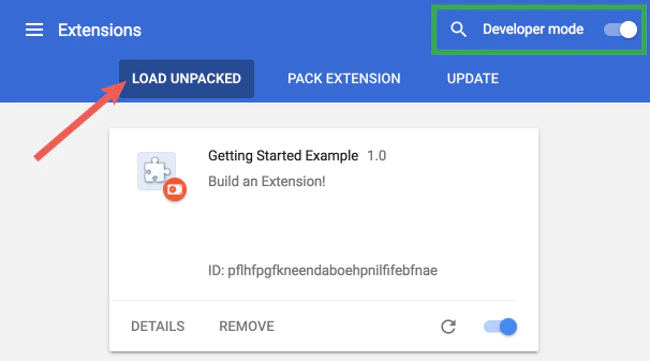
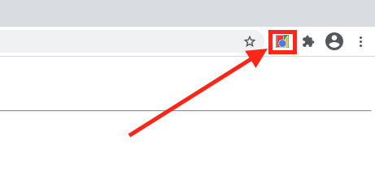

# Documentation pour l'extension Keep Control of Your Data

- L'extension fonctionne uniquement sur le navigateur **google chrome**

## Installation

Afin d'utiliser l'extension au sein d'un navigateur google chrome il faut :

- Ouvrir chrome et se rendre à l'url chrome://extensions/`
- Activer le mode de développement
- Choisir *'Load unpacked'*
- Puis sélectionner le dossier où sont présent tous les codes de l'extension (Le dossier où est présent ce readme)



## Utilisation

- Afin d'utiliser votre propre service pour stocker vos données personnelles il faut changer l'url présente dans le fichier `content_script-2`
  ```javascript
  let settings = {
    // This url need to be changed to your own self storage
    "url": "...",
    "method": "POST",
    "timeout": 0,
    "processData": false,
    "mimeType": "multipart/form-data",
    "contentType": false,
    "data": form,
    "async": false
  };
  ```
- Afin d'activer le code permettant le principe ISE, il faut clicker sur le logo de l'extension avant d'envoyer le formulaire à intercepter



## Explication des différents fichiers

Les fichiers standards dans le développement d'extension ne seront pas réexpliqué ici (notamment le manifest)

### `content_script-1.js`

Ce content script implémente le principe Récupération-Affichage, actuellement il peut traiter :

- Les balises `<e-img>`, `<e-txt>` et partiellement les balises `<e-vid>`.
- Les images étant des qrcode et contenant un lien vers une ressource distante.

### `background.js`

Ce script permet d'injecter notre `content_script-2.js` afin d'intercepter les formulaires

### `content_script-2.js`

Ce script implémente le principe Interception-Stockage-Envoi, il permet de stocker les données de l'utilisateur sur le serveur défini puis de générer les fausse données qui sont renvoyées au service.
